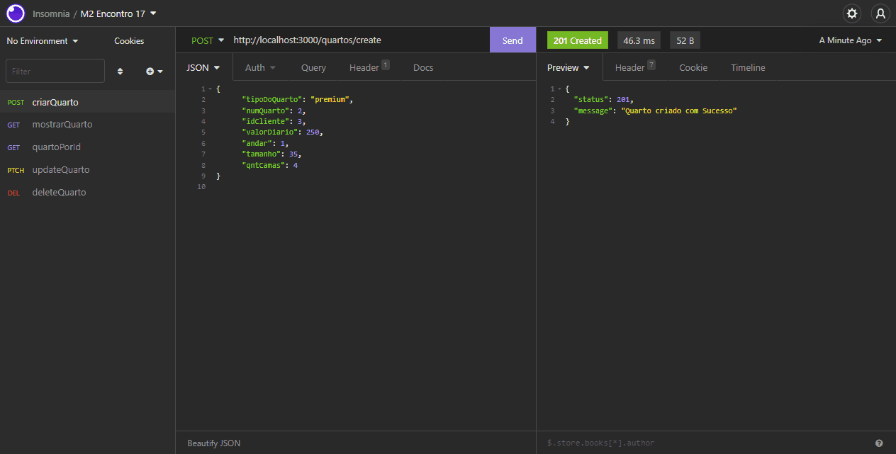

<br />
<p align="center">
    

  <h3 align="center">API Hotel com Node, Express, Sequelize e SQLite</h3>
 <br />
  <p align="center">
     Sumário
      <p align="center">
  <a href="#sobre"> Sobre </a> |
  <a href="#conhecimentos-praticados"> Conhecimentos praticados </a> |
  <a href="#rotas-da-aplicação"> Rotas da aplicação </a> |
  <a href="#tecnologias-utilizadas"> Tecnologias utilizadas </a>      
       <br />
    <br />
    <h1 align="center">
    
 </h1>
  </p>
</p>

# Sobre

O objetivo do projeto foi criar uma API para um hotel utilizando Node, Express, Sequelize e SQLite como projeto final do Módulo 4 da Turma 10 do curso de Desenvolvimento Web Fullstack Resilia.

Cada integrante do grupo ficou responsável pela criação de uma API referente à um dos serviços do hotel.

Sendo eles: clientes, funcionários, cardápio, filiais e quartos.

Nesta aplicação é possível cadastrar, listar, atualizar e deletar quartos.

# Conhecimentos Praticados

✔ NodeJs <br>
✔ Express <br>
✔ SQLite3 <br>
✔ Sequelize <br>
✔ CRUD com Sequelize <br>
✔ Padrão MVC

# Rotas da aplicação:

## Quartos

<b>[GET] </b> /quartos - A rota deve exibir todos os quartos cadastrados.<br>

<b>[GET] </b> /quartos/:id - A rota deve listar um quarto baseado em seu ID.<br>

<b>[POST] </b> /quartos/create - A rota deve criar um quarto com as informações passadas no body da requisição.<br>

```javascript
{
   "tipoDoQuarto": "luxo",
   "numQuarto": 2,
   "idCliente": 3,
   "valorDiario": 250,
   "andar": 5,
   "tamanho": 35,
   "qntCamas": 4
}
```

<b>[PATCH] </b> /quartos/:id - A rota deve atualizar um quarto com as informações passadas no body da requisição. Caso necessário apenas uma informação pode ser atualizada por vez.<br>

```javascript
{
   "tipoDoQuarto": "premium",
   "numQuarto": 2,
   "idCliente": 3,
   "valorDiario": 250,
   "andar": 5,
   "tamanho": 35,
   "qntCamas": 4
}
```

<b>[DELETE] </b> /quartos/:id - A rota deve deletar um quarto baseado em seu ID.<br>

# Validação de dados

Foi adicionada as seguintes validações para os dados recebidos nas requisições: <br><br>
<b>[POST] </b> /quartos/create <br>

- O campo "tipoDoQuarto" deve receber uma entre as opções: luxo, premium, solteiro, casal ou família;<br>
- O campo "numQuarto" deve receber um número inteiro;<br>
- O campo "idCliente" deve receber um número inteiro;<br>
- O campo "valorDiario" pode receber um número inteiro ou um número decimal;<br>
- O campo "andar" deve receber um número inteiro;<br>
- O campo "tamanho" deve receber um número inteiro entre 15 a 35;<br>
- O campo "qntCamas" deve receber um número inteiro entre 1 e 4.<br><br>

# Rodando o projeto:

### Pré-requisitos:

Antes de começar, você precisará instalar em sua máquina as seguintes ferramentas:
[Git](https://git-scm.com), [Node.js](https://nodejs.org/en/) e [Insomnia](https://insomnia.rest/download). <br> Além disso, é aconselhável ter um editor como o [VSCode](https://code.visualstudio.com/) para trabalhar com o código!

### Instalando e rodando o projeto:

```bash
# Clone este repositório
$ git clone https://github.com/mjantunes2/API-Hotel-Quarto

# Acesse a pasta do projeto no terminal
$ cd API-Hotel-Quarto

```

**Desenvolvido por <a href="https://www.linkedin.com/in/bruno-andreotti/" > Bruno Andreotti</a>, <a href="https://www.linkedin.com/in/denise-g-oliveira/" > Denise Oliveira </a>, <a href="https://www.linkedin.com/in/heitorschumann/" > Heitor Schumann </a>, <a href="https://www.linkedin.com/in/henrique-ferraz-a46123219/" > Henrique Ferraz </a>, <a href="https://www.linkedin.com/in/murilo-antunes-bb1143228/" > Murilo Antunes </a>.** 

